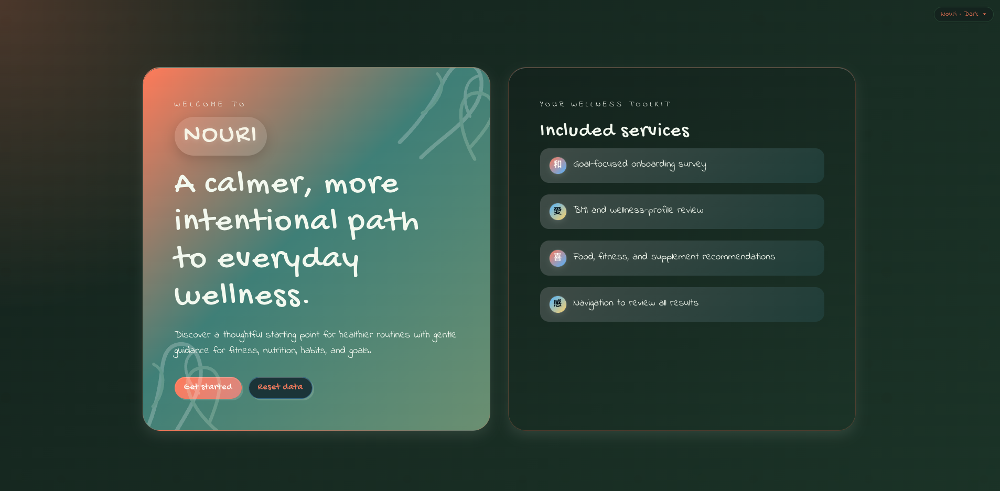

# Nouri

A polished, front-end wellness experience designed to make healthy habits feel more personalized, approachable, and motivating.



Nouri guides users through a short survey to understand their goals, preferences, lifestyle, and restrictions, then turns that information into a tailored dashboard with recommendations for food, fitness, supplements, hydration, and wellness resources in their area or wherever they are.

## Live demo

- Demo link: [Nouri Demo](https://morganleigh13.github.io/)

## Problem

Many wellness apps feel generic or overwhelming. Nouri aims to make wellness guidance feel more customized and easier to understand by helping users build a simple profile and receive relevant suggestions based on their goals and preferences.

## Value

Nouri creates value by:

- turning a basic wellness questionnaire into a more personalized experience
- helping users explore realistic nutrition, fitness, and supplement ideas
- presenting recommendations in a calm, premium-feeling interface
- making wellness planning feel more guided and less intimidating

## Project plan

The project was planned as a React + Vite prototype focused on experience design and personalization. The approach included:

1. Building a guided onboarding flow with a structured survey
2. Capturing user responses in centralized state
3. Generating tailored recommendations from the survey data
4. Presenting those results in a dashboard with clear wellness categories
5. Giving tailored resources to the user by location

## Features

### Completed

- Guided landing experience
- Multi-step survey with validation and required selections
- Personalized dashboard overview
- Food, fitness, supplement, and resource recommendation sections
- BMI and healthy-weight insight display
- Local storage for survey data across refreshes
- Toast-based validation feedback for incomplete steps

### Planned next

- connect to internet to get real resource data
- Connect the app to a backend or persistent user account system
- Expand recommendations with richer, more dynamic content
- Add more advanced personalization rules and progress tracking


## Commit history

This repository contains two related storylines:

### Nouri app history
A full record of the original Nouri app development milestones:

### GitHub Pages hosting history
The commits specific to turning this repo into a live GitHub Pages site:

- d742651 — Had to use hash router for static hosting. Also removed reset button from landing page.
- 6253d3f — Update dependencies
- 8e88467 — Changes to react-router. dom is deprecated.
- 3416c8c — Configure GitHub Pages deployment
- f1913bd — Created new repository to host site on GitHub Pages.

### Nouri Development history

- 06320af — Adds picture and updates readMe
- 0d34313 — Increases font size
- 9daa5b8 — Working on getting photos right
- 747be25 — Found images on Pexels for supplements
- 0eff42b — Working around image availability issues by using duplicates for now
- 12c2a3e — Adds React Hot Toast feedback for incomplete survey steps
- 02bc001 — Console logged weights and made sure each step was accurate; tested data a few ways
- 9594236 — Stores survey responses in local storage and establishes BMI logic
- 22df5b9 — Adjusts spacing in survey forms
- 5ffed96 — Experiments with fonts and button colors
- 59b1457 — Trying out different fonts
- f9f9835 — Styles the app with DaisyUI and improves button and list clarity
- d7a8a24 — Adding Claude
- 9f4af15 — Adds custom DaisyUI themes for light and dark mode
- a2ebd79 — Switched to Codex, fixed recommendation reference issues, raised the older-adult age range, and added a README
- ced7ccf — Adds dynamic fitness-resource filtering by state and city
- 75656e7 — Anchors resource-page sections to left-side navigation
- 4cb7776 — Adds images and details to the supplements tab and recommendation links
- 54b891b — Adds images and detailed instructions to the fitness dashboard section
- 071d0cb — Fixes a bug affecting vegan restrictions
- 5d8d0ef — Splits the app into landing, survey, and dashboard routes for better organization
- 3e8249c — Builds the landing page and dashboard structure with resource links
- 5cd234c — Adds React, Vite, Redux, DaisyUI, and Tailwind
- 69d09ab — Initial commit


## Technologies used

- React
- Vite
- Redux Toolkit
- Tailwind CSS
- DaisyUI


## AI tools used

- GitHub Copilot
- Additional AI support used during UI planning, content generation, and implementation refinement

## Running the project

Follow these steps to clone the project from GitHub and run it on your own computer.

### 1. Clone the repository

Open your terminal and run:

```bash
git clone https://github.com/morganleigh13/Nouri.git
cd Nouri
```

### 2. Install dependencies

Inside the project folder, install the required packages:

```bash
npm i
```

### 3. Start the development server

Run the app locally:

```bash
npm run dev
```

This will start a local Vite development server. Open the local address shown in your terminal, usually:

```text
http://localhost:5173
```
Enjoy!! 

## Data and safety

This project is a front-end prototype and does not include a backend, authentication system, or live data integration. Recommendations are curated mock content intended for demonstration and educational purposes.

The app is not medical advice. Users should verify ingredients, fitness plans, and supplement choices with qualified professionals where appropriate.

## Future notes


